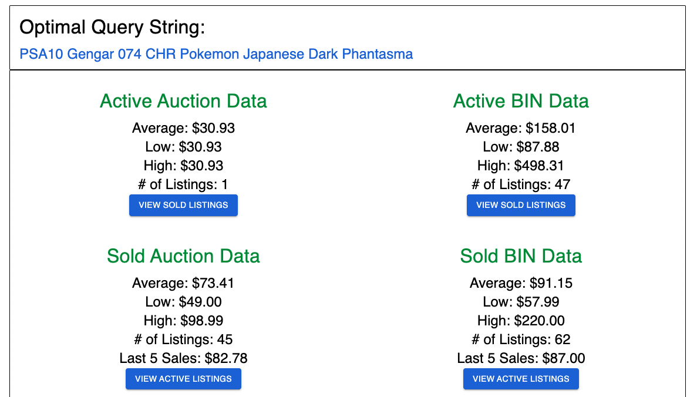

# CardCompanion

A price research tool for trading card sellers on eBay. Search for any graded or ungraded card and get real-time market data across four categories.

**Live:** https://cardcompanion.onrender.com

---

## Screenshots





---

## Features

- **Active Auction listings** — current auctions with price stats
- **Active BIN listings** — current Buy It Now listings with price stats
- **Sold Auction listings** — recently sold auctions with price history chart
- **Sold BIN listings** — recently sold BIN listings with price history chart

Each section shows average, low, high, and listing count. Sold sections include a price-over-time chart and a "last 5 sales" average.

---

## Search Fields

| Field | Description |
|---|---|
| Grade | PSA 10, BGS 9.5, CGC 10, etc. |
| Card Name | e.g. Charizard, Gengar |
| Card Number | e.g. 074, 4/102 |
| Card Rarity | CHR, SAR, Alt Art, Holo, etc. |
| Card Game | Pokemon, MTG, etc. |
| Language | Japanese, English, etc. |
| Set Name | e.g. Dark Phantasma, Base Set |
| Additional Detail | Any extra search terms |

Results are filtered client-side against the eBay listings to match your specific card.

---

## Tech Stack

- **Frontend:** React 19, Vite, Material UI
- **Backend:** Node.js, Express 5
- **Active listings:** eBay Browse API
- **Sold listings:** Puppeteer (headless Chrome scraper)

---

## Local Development

**Requirements:** Node.js 18+

```bash
# Install root dependencies
npm install

# Install client and server dependencies
npm install --prefix client
npm install --prefix server
```

Create a `.env` file in `/server`:

```
EBAY_PROD_CLIENT_ID=your_client_id
EBAY_PROD_CLIENT_SECRET=your_client_secret
```

```bash
# Run both client and server concurrently
npm run dev
```

- Client: http://localhost:5173
- Server: http://localhost:3001

---

## Notes

- Sold listings data is scraped from eBay's completed listings pages. If eBay updates their page layout, scraper selectors in `server/utils/utils.js` may need to be updated.
- The eBay Browse API does not provide sold listing data at the standard access tier — scraping is used as a workaround.
